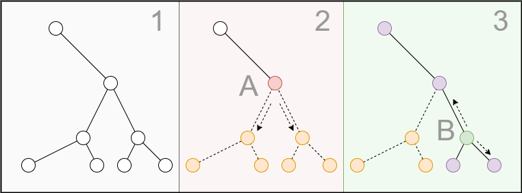

# 🎲 JS pkg tools

Чтение, модификация и запись `*.json` файлов. 

    npm i -D nodejs-pkg-tools

- [Использование](#использование)
- [Обработка узлов](#обработка-узлов)
- [Опции и формат пути](#опции-и-формат-пути)

Что делает этот пакет:

* Чтение `package.json` или любого валидного `json`.
* Включение/исключение свойств. 
* Переопределение свойств пользовательским модификатором.
* Использование шаблона `foo.*.bar` с модификатором для доступа к нескольким свойствам одного уровня.
* Запись файла в установленный путь.
* Доступна обычная функция `modify({json: '...'}).toValue() -> {...}` без доступа к файловой системе.
* Дополнительные функции очистки `clearDir(...)` и копирования каталога `copyDir(...)`.

## Использование

Скопируйте файл в другой каталог, изменив некоторые свойства и относительные пути всего уровня `exports:{}`.

```js
const nodeRoot = rwModify({
  mode: 'over',
  exclude: ['devDependencies', 'private'],
  sample: {
    'version': '0.8.5-alpha'
    // Модифицируйте все пути одним выражением.
    'exports.*.*': makeModifier((value, key, path) => 
                   [true, true, value.replace('dist/', '')])
  }
}, './package.json', './dist/package.json')
```

* Было

```js
{
  "version": "0.8.4",
  ...
  "devDependencies": { ... },
  "private": true,
  "exports": {
    ".": {
      "import": "./dist/index.js",
      "types": "./dist/index.d.ts"
    }
  }
}
```

* Стало

```js
{
  "version": "0.8.5-alpha",
  ...
  "exports": {
    ".": {
      "import": "./index.js",
      "types": "./index.d.ts"
    }
  }
}
```

##  Обработка узлов

После создания дерева узлов(1), каждый _node_ помечается флагом _удалить/оставить_, зависит от опции `mode`.

При удалении(2), например узла __A__, флаг удаления распространяется вниз по дереву, но не удаляет узлы. Пока узел явно не переопределен его можно восстановить.

На следующем этапе(3) можно сохранить ранее удаленный узел, например __B__. Сохранение распространяется в обе стороны - вверх до корневого _node_ и вниз по дочерним узлам.



Когда на результирующем объекте вызывается `toValue()` или `toJson()`, дерево собирается сверху, отбрасывая узлы отмеченные флагом _remove_.

>🧹 Пустые `{}|[]` фильтруются и не включаются в результат. Вот такое `{foo:{bar:{box:[]}}}` - преобразуется в такое `{}`.

## Опции и формат пути

Путь к свойствам описывается строкой с разделителем `"."`. Звездочка `"*"` определяет любое свойство в структуре или массиве. В `TypeScript` путь имеет псевдоним `type KeyPath = string`.

    "foo.bar"    <- Ok
    "box.**"     <- Bad - Двойные ".." и "**" недопустимы.
    "over..tor"  <- Bad
    ".game.oh."  <- Bad - В начале и конце нельзя ".". 
    "well.be.*"  <- Ok  - Звездочки "*" можно.
    "*.*.*.*.*"  <- Ok 👀

Этот пакет имеет три основных функции:

```js
import { 
  type IRootNode, ... несколько разных типов,
  makeModifier, modify, rwModify 
} from 'nodejs-pkg-tools'

// Модификатор используемый в параметре Options.sample.
const marker = makeModifier(boolean | Modifier): ModifierMarker
// Модификация Json-строки или валидной структуры {}|[].
const nodeRoot = modify(options: Options): IRootNode
// Чтение и запись файла.
const rwNodeRoot = rwModify (options: Options, src?: string, dest?: string): IRootNode
```

__Options__: `{json?|value?, mode?, space?, include?, exclude?, sample?}`

Объект опций.

__Options.mode__: `'strict'(default)|'over'|'error'|'strict_error'|'over_error'`

От выбранного режима зависит установка флагов по умолчанию и действие при ошибках:

* `"strict"`(default) - Всем _node_ устанавливается _remove_-флаг. Сохранить узел можно явной установкой пути в `include` или в модификаторе `sample`.
* `"over"` - Поведение обратное `"strict"`.
* `"error"` - Любая ошибка, например _невалидное значение_, предотвращает дальнейшую обработку. Результат будет иметь `nodeRoot.isFatalError:true`. Ошибки не влияющие на результат, когда не существует пути `exclude`, игнорируются.

Параметр `mode` тестируется регулярным выражением и может быть установлен в любых вариациях, даже так `error_2022_over`.

Ошибки разбора _Json_ или чтения файла, всегда являются фатальными и не возвращают ожидаемый результат. Функции не выбрасывают исключений, проверять наличие ошибок следует через интерфейс `IRootNode`. В случае `isFatalError`, текущий результат будет потерен и `toJson()` или `toValue()`, будут возвращать `""` или `null`.

> 📌 Не устанавливайте `error` при преобразовании `JS`-объекта, где могут быть `function`, `undefined` и `symbol`. В этом случае невалидные значения игнорируются и ошибка не устанавливается, в том числе и для ошибок поиска путей. Список всех ошибок всегда доступен через `IRootNode.errors:IErrors`.

Больше информации в файле [src/errors.ts](src/errors.ts).

__Options.space__: `number>=0`(default: 2)

Это значение будет передано в `JSON.stringify(value, null, space)`.

__Options.json__?: `string` | __Options.value__?: `JsonPrimitive|[]|{}`

Строка _Json_ или валидное значение. Объект содержащий `function|Symbol|BigInt|undefined` недопустим и вызовет ошибку, если установлено `mode:'error'`.

`rwModify(opts, src?, dest?)` можно использовать с любым вариантом источника данных в порядке приоритета `src? || json? || value`.

__Options.include__: `KeyPath[]`

Массив путей для включения. Этот массив устанавливает флаг _сохранить_свойство_ в первую очередь.

__Options.exclude__: `KeyPath[]`

Применяется после `Options.include`.
 
__Options.sample__: `{...}|[...][]`

* `{[k in KeyPath]: ValidValue | ModifierMarker}`
* `[KeyPath, ...][]`
* `[string[], ...][]`

Объект или массив позволяющий _удалять/модифицировать/устанавливать_ новые свойства и их значения. В отличие от `include/exclude`, здесь нет определенного порядка действий. Свойства можно удалить, добавить, изменить и снова удалить.

```js
import { type Sample, makeModifier, modify, rwModify } from 'nodejs-pkg-tools'

const sample: Sample = {
  // Отметим весь узел для удаления...
  "your.very": makeModifier(false),
  // ... и оставим вложенный узел - он все еще существует.
  "your.very.long": makeModifier(true)

  // Независимо от наличия свойства в целевом объекте,
  // оно будет создано. Глубина не имеет значение.
  // Путем всегда является ключ, а значением {foo: "bar"}.
  "your.very.long.path": {foo: "bar"},
  // Определять путь в виде вложенных структур нельзя.
  // Неясно: путь это или значение {very:...}.
  your: {very: {long: { path: {foo: "bar"}}}}
}
```

Несмотря на удобный формат `{key: value}`, объекты, имеющие целочисленные ключи, [самовольно распоряжаются сортировкой](https://developer.mozilla.org/en-US/docs/Web/JavaScript/Reference/Statements/for...in). Точный порядок обработки можно определить массивом записей.

```js
// Такое определение ...
const sample: Sample = [
  ["your.path.*", makeModifier((value, key, path) => {...})],
  ["engines.node", "^18.7.0"]
]
// ... эквивалентно
const sample: Sample = {
  "your.path.*": makeModifier((value, key, path) => {...}),
  "engines.node": "^18.7.0"
}
```

Формат определения `KeyPath` не позволяет указать точки `"."` и звездочки `"*"`. Такие ключи передаются массивом.

```js
const sample: Sample = [
  [["exports", "."], "newValue"],
  // Массив пути не обрабатывается и используется как есть.
  [["description", "bar**..box", "repo", ""], makeModifier(true)]
  // Имя свойства ->^^^^^^^^^^           ^^<- и это имя
]
```

Смешивать различные варианты `Sample` не допускается.

__Modifier(value, key, [])__: `boolean | [boolean, boolean, (Primitive|[]|{})]`

Пользовательский обработчик принимает три аргумента:

* `value: (Primitive|[]|{})` - Значение запрашиваемого свойства.
* `key: (null|string|number)` - Ключ или `null`, если это корень. Последний элемент в массиве `path`.
* `path: (string|number)[]` - Путь от корня или пустой массив.

Функция должна возвратить один из вариантов:

* `boolean`:
  + `true` - Игнорировать, свойство может быть удалено или сохранено в зависимости от текущих установок.
  + `false` - Прервать обработку и установить фатальную ошибку.
* `[boolean, boolean, (Primitive|[]|{})]`:
  + `[0]!` - Если `false` свойство будет удалено, при этом остальные элементы игнорируются. При `true` оценивается элемент `[1]` и свойству устанавливается флаг _сохранения_.
  + `[1]?` - Действие. При `true` обновляем значение из `[2]`, иначе оставляем оригинал.
  + `[2]?` - Любое валидное значения для переопределения текущего свойства, должно быть установлено если `[0]:true` и `[1]:true`.

> 📌 Обработчик должен устанавливаться через `makeModifier()`. Любое другой тип оценивается как значение для переопределения свойства.

Этот [файл 📄](src/types.ts) содержит все доступные интерфейсы с комментариями. 
